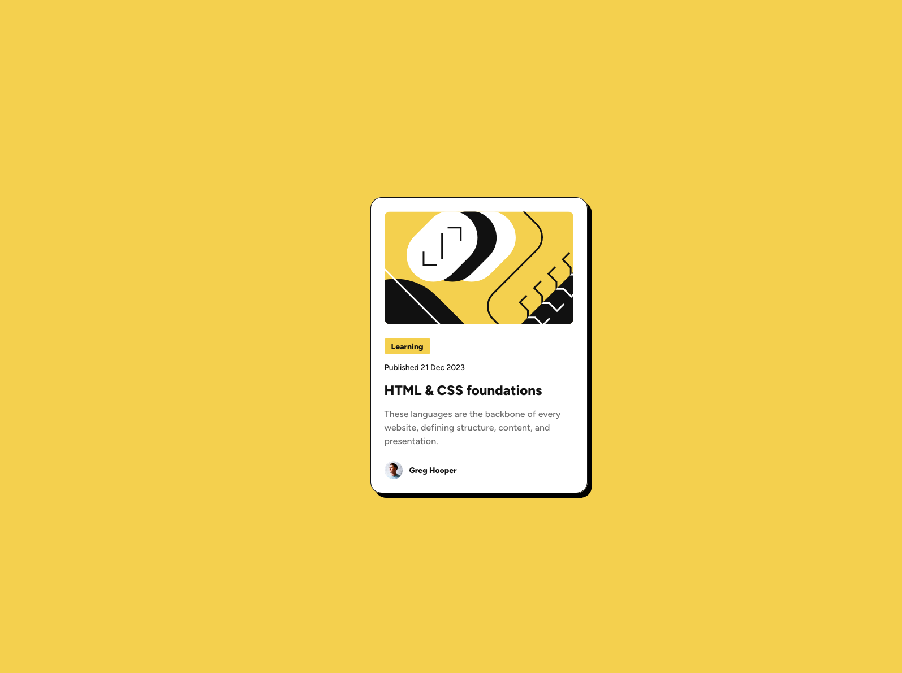

# Frontend Mentor - Blog preview card solution

This is a solution to the [Blog preview card challenge on Frontend Mentor](https://www.frontendmentor.io/challenges/blog-preview-card-ckPaj01IcS). Frontend Mentor challenges help you improve your coding skills by building realistic projects.

## Table of contents

- [Frontend Mentor - Blog preview card solution](#frontend-mentor---blog-preview-card-solution)
  - [Table of contents](#table-of-contents)
  - [Overview](#overview)
    - [The challenge](#the-challenge)
    - [Screenshot](#screenshot)
    - [Links](#links)
  - [My process](#my-process)
    - [Built with](#built-with)
    - [What I learned](#what-i-learned)
    - [Continued development](#continued-development)
      - [Areas to focus](#areas-to-focus)
    - [Useful resources](#useful-resources)
    - [AI Collaboration](#ai-collaboration)
  - [Author](#author)

**Note: Delete this note and update the table of contents based on what sections you keep.**

## Overview

### The challenge

Users should be able to:

- See hover and focus states for all interactive elements on the page

### Screenshot



### Links

- Solution URL: [Add solution URL here](https://github.com/astrodeveloper10/blog-preview-card-main)
- Live Site URL: [Add live site URL here](https://blog-preview-card-main-five-dusky.vercel.app/)

## My process

### Built with

- Semantic HTML5 markup
- CSS custom properties
- Flexbox
- CSS Grid
- Mobile-first workflow
- BEM naming

### What I learned

I have started using CSS custom properties (aka CSS variables) and BEM for naming selectors.

Learned how to use Grid and Flexbox to center an element in inline and block direction.

Self hosted fonts using @font-face.

Used `calc()` to calculate the font size in rem

```css
:root {
  --fs-12: calc(12rem / 16);
  --fs-14: calc(14rem / 16);
  --fs-16: calc(16rem / 16);
  --fs-20: calc(20rem / 16);
  --fs-24: calc(24rem / 16);
}
```

### Continued development

#### Areas to focus

- Building layouts (Flexbox, Grid)
- Semantic HTML
- BEM naming

### Useful resources

- [Pixels and accessibility](https://www.joshwcomeau.com/css/surprising-truth-about-pixels-and-accessibility/) - This helped me for calculating the font sizes using `calc()`. I really liked this pattern and will use it going forward.
- [CSS Reset](https://www.joshwcomeau.com/css/custom-css-reset/) - This is an amazing article for learning about the CSS reset rules and what each rule does.

### AI Collaboration

Describe how you used AI tools (if any) during this project. This helps demonstrate your ability to work effectively with AI assistants.

- What tools did you use (e.g., ChatGPT, Claude, GitHub Copilot)?
  - Google Gemini
- How did you use them (e.g., debugging, generating boilerplate, brainstorming solutions)?
  - To learn more about BEM naming

## Author

- Frontend Mentor - [@astrodeveloper10](https://www.frontendmentor.io/profile/astrodeveloper10)
